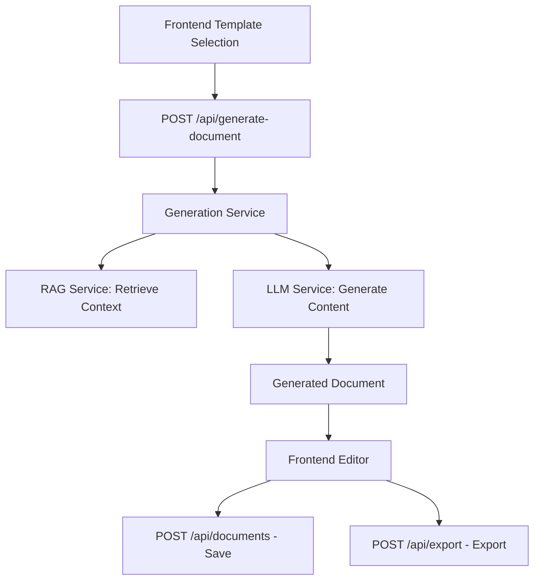

# Frontend Components & Data Models for FastAPI Backend Integration

## 📋 **Frontend Component Architecture Overview**

```
src/
├── components/
│   ├── Layout/          # UI Layout Components
│   ├── Editor/          # Document Editing
│   ├── Templates/       # Template Management
│   ├── Files/           # File Management
│   ├── Citations/       # Citation System
│   ├── Export/          # Document Export
│   ├── History/         # Document History
│   ├── Chat/            # AI Chat Interface
│   └── Settings/        # Configuration
├── services/            # API Services
├── contexts/            # React Context
└── utils/               # Utilities
```

## 🔧 **Core Data Models & Interfaces**

### **1. Template System**
```typescript
interface TOCItem {
  id: string;
  title: string;
  level: number;
  pageNumber?: number;
  children?: TOCItem[];
}

interface Template {
  id: string;
  name: string;
  description: string;
  type: 'uploaded' | 'manual';
  createdAt: Date;
  lastModified: Date;
  toc: TOCItem[];
  content?: string;
  status: 'draft' | 'ready' | 'generating';
}
```

**FastAPI Backend Needed:**
```python
# models/template.py
class TOCItem(BaseModel):
    id: str
    title: str
    level: int
    page_number: Optional[int] = None
    children: Optional[List['TOCItem']] = None

class Template(BaseModel):
    id: str
    name: str
    description: str
    type: Literal['uploaded', 'manual']
    created_at: datetime
    last_modified: datetime
    toc: List[TOCItem]
    content: Optional[str] = None
    status: Literal['draft', 'ready', 'generating']

# endpoints/templates.py
@router.get("/templates", response_model=List[Template])
@router.post("/templates", response_model=Template)
@router.put("/templates/{template_id}", response_model=Template)
@router.delete("/templates/{template_id}")
@router.post("/templates/{template_id}/generate")
```

### **2. Document Generation**
```typescript
interface GeneratedSection {
  id: string;
  title: string;
  content: string;
  type: 'text' | 'table';
}

interface GeneratedCitation {
  id: number;
  text: string;
  source: string;
  page: number;
}

interface GeneratedDocument {
  id: string;
  title: string;
  sections: GeneratedSection[];
  citations: GeneratedCitation[];
  templateId: string;
  generatedAt: Date;
}
```

**FastAPI Backend Needed:**
```python
# models/document.py
class GeneratedSection(BaseModel):
    id: str
    title: str
    content: str
    type: Literal['text', 'table']

class GeneratedCitation(BaseModel):
    id: int
    text: str
    source: str
    page: int

class GeneratedDocument(BaseModel):
    id: str
    title: str
    sections: List[GeneratedSection]
    citations: List[GeneratedCitation]
    template_id: str
    generated_at: datetime

# endpoints/generation.py
@router.post("/generate-document", response_model=GeneratedDocument)
async def generate_document_from_template(
    template: Template,
    llm_config: Optional[LLMConfig] = None
):
    # Your LLM integration here
    pass
```

### **3. File Management**
```typescript
interface FileItem {
  id: string;
  name: string;
  type: 'file' | 'folder';
  size?: number;
  lastModified: Date;
  path: string;
  parent?: string;
  children?: FileItem[];
}

interface UploadProgress {
  fileId: string;
  fileName: string;
  progress: number;
  status: 'uploading' | 'completed' | 'error';
}
```

**FastAPI Backend Needed:**
```python
# models/files.py
class FileItem(BaseModel):
    id: str
    name: str
    type: Literal['file', 'folder']
    size: Optional[int] = None
    last_modified: datetime
    path: str
    parent: Optional[str] = None
    mime_type: Optional[str] = None

# endpoints/files.py
@router.get("/files", response_model=List[FileItem])
@router.post("/files/upload")
@router.delete("/files/{file_id}")
@router.get("/files/{file_id}/download")
@router.post("/files/create-folder")
```

### **4. Document History**
```typescript
interface StoredDocument {
  id: string;
  title: string;
  content: string;
  templateId?: string;
  createdAt: Date;
  lastModified: Date;
  version: number;
  status: 'draft' | 'published' | 'archived';
  tags: string[];
}
```

**FastAPI Backend Needed:**
```python
# models/history.py
class StoredDocument(BaseModel):
    id: str
    title: str
    content: str
    template_id: Optional[str] = None
    created_at: datetime
    last_modified: datetime
    version: int
    status: Literal['draft', 'published', 'archived']
    tags: List[str]

# endpoints/documents.py
@router.get("/documents", response_model=List[StoredDocument])
@router.get("/documents/{doc_id}", response_model=StoredDocument)
@router.post("/documents", response_model=StoredDocument)
@router.put("/documents/{doc_id}", response_model=StoredDocument)
@router.delete("/documents/{doc_id}")
```

### **5. Export System**
```typescript
interface ExportOptions {
  format: 'pdf' | 'docx' | 'html' | 'txt';
  includeMetadata: boolean;
  includeCitations: boolean;
  pageSize?: 'a4' | 'letter';
  margins?: {
    top: number;
    right: number;
    bottom: number;
    left: number;
  };
}
```

**FastAPI Backend Needed:**
```python
# models/export.py
class ExportOptions(BaseModel):
    format: Literal['pdf', 'docx', 'html', 'txt']
    include_metadata: bool = True
    include_citations: bool = True
    page_size: Optional[Literal['a4', 'letter']] = 'a4'
    margins: Optional[Dict[str, float]] = None

# endpoints/export.py
@router.post("/export")
async def export_document(
    document_id: str,
    options: ExportOptions
) -> FileResponse:
    # Generate and return file
    pass
```

### **6. Citation System**
```typescript
interface Citation {
  id: number;
  text: string;
  source: string;
  page: number;
  sourceFileId?: string;
  url?: string;
  doi?: string;
  authors?: string[];
  publicationDate?: Date;
}
```

**FastAPI Backend Needed:**
```python
# models/citations.py
class Citation(BaseModel):
    id: int
    text: str
    source: str
    page: int
    source_file_id: Optional[str] = None
    url: Optional[str] = None
    doi: Optional[str] = None
    authors: Optional[List[str]] = None
    publication_date: Optional[datetime] = None

# endpoints/citations.py
@router.get("/citations", response_model=List[Citation])
@router.post("/citations", response_model=Citation)
@router.put("/citations/{citation_id}", response_model=Citation)
@router.delete("/citations/{citation_id}")
```

### **7. Chat/AI System**
```typescript
interface ChatMessage {
  id: string;
  text: string;
  sender: 'user' | 'assistant';
  timestamp: Date;
  context?: {
    documentId?: string;
    sectionId?: string;
  };
}

interface ChatSession {
  id: string;
  messages: ChatMessage[];
  createdAt: Date;
  lastActivity: Date;
}
```

**FastAPI Backend Needed:**
```python
# models/chat.py
class ChatMessage(BaseModel):
    id: str
    text: str
    sender: Literal['user', 'assistant']
    timestamp: datetime
    context: Optional[Dict[str, str]] = None

class ChatSession(BaseModel):
    id: str
    messages: List[ChatMessage]
    created_at: datetime
    last_activity: datetime

# endpoints/chat.py
@router.post("/chat/sessions", response_model=ChatSession)
@router.get("/chat/sessions/{session_id}", response_model=ChatSession)
@router.post("/chat/sessions/{session_id}/messages")
@router.post("/chat/generate-response")
```

## 🌐 **API Integration Points**

### **Frontend Service Layer**
```typescript
// services/api.ts - Update these to call your FastAPI
class APIService {
  baseURL = 'http://localhost:8000/api'  // Your FastAPI URL
  
  // Template endpoints
  async getTemplates(): Promise<Template[]>
  async createTemplate(template: Template): Promise<Template>
  async generateFromTemplate(templateId: string): Promise<GeneratedDocument>
  
  // Document endpoints  
  async getDocuments(): Promise<StoredDocument[]>
  async saveDocument(doc: StoredDocument): Promise<StoredDocument>
  async exportDocument(docId: string, options: ExportOptions): Promise<Blob>
  
  // File endpoints
  async uploadFile(file: File): Promise<FileItem>
  async getFiles(): Promise<FileItem[]>
  async deleteFile(fileId: string): Promise<void>
  
  // Citation endpoints
  async getCitations(): Promise<Citation[]>
  async createCitation(citation: Citation): Promise<Citation>
  
  // Chat endpoints
  async sendChatMessage(message: string, sessionId?: string): Promise<ChatMessage>
  async getChatHistory(sessionId: string): Promise<ChatSession>
}
```

## 🚀 **FastAPI Project Structure Recommendation**

```python
# FastAPI Backend Structure (Recommended)
├── app/
│   ├── main.py                     # FastAPI app instance and router setup
│   ├── models/                     # Pydantic data models (the API contract)
│   │   ├── __init__.py
│   │   ├── document.py             # Document & generation models
│   │   ├── file.py                 # File management models
│   │   ├── template.py             # Template & TOC models
│   │   ├── export.py               # Export options & formats
│   │   ├── citation.py             # Citation models
│   │   └── chat.py                 # Chat & AI interaction models
│   ├── endpoints/                  # API route definitions
│   │   ├── __init__.py
│   │   ├── documents.py            # Document CRUD operations
│   │   ├── files.py                # File upload/management endpoints
│   │   ├── templates.py            # Template management & parsing
│   │   ├── generation.py           # LLM document generation endpoints
│   │   ├── export.py               # Document export endpoints
│   │   ├── citations.py            # Citation management
│   │   └── chat.py                 # AI chat functionality
│   ├── services/                   # Business logic (refactored from Streamlit)
│   │   ├── __init__.py
│   │   ├── rag_service.py          # PDF parsing, embedding, retrieval (RAG core)
│   │   ├── generation_service.py   # LLM calls for synthesis and refinement
│   │   ├── export_service.py       # PDF/DOCX generation (ReportLab logic)
│   │   ├── file_manager.py         # Handles file storage and retrieval
│   │   ├── template_service.py     # Template processing & TOC parsing
│   │   ├── citation_service.py     # Citation extraction & management
│   │   └── chat_service.py         # AI chat & assistance logic
│   ├── core/
│   │   ├── __init__.py
│   │   ├── config.py               # API keys, settings, environment config
│   │   ├── database.py             # Database connection & session management
│   │   └── security.py             # Authentication & authorization (optional)
│   ├── utils/
│   │   ├── __init__.py
│   │   ├── parsers.py              # TOC parsing logic from various formats
│   │   ├── validators.py           # Input validation utilities
│   │   └── helpers.py              # Common utility functions
│   └── database/                   # Database models & operations (optional)
│       ├── __init__.py
│       ├── models.py               # SQLAlchemy models
│       └── crud.py                 # Database CRUD operations
├── .env                            # Environment variables (API keys)
├── requirements.txt                # Python dependencies
├── alembic.ini                     # Database migrations (if using SQLAlchemy)
└── README.md                       # Setup and usage instructions
```

## 🔧 **FastAPI App Structure Integration**

### **main.py - FastAPI App Setup**
```python
from fastapi import FastAPI
from fastapi.middleware.cors import CORSMiddleware
from app.endpoints import documents, files, templates, generation, export, citations, chat
from app.core.config import settings

app = FastAPI(
    title="CMC Regulatory Writer API",
    description="FastAPI backend for CMC regulatory document generation",
    version="1.0.0"
)

# CORS middleware for frontend integration
app.add_middleware(
    CORSMiddleware,
    allow_origins=["http://localhost:5176"],  # Your frontend URL
    allow_credentials=True,
    allow_methods=["*"],
    allow_headers=["*"],
)

# Include routers
app.include_router(templates.router, prefix="/api")
app.include_router(generation.router, prefix="/api")
app.include_router(documents.router, prefix="/api")
app.include_router(files.router, prefix="/api")
app.include_router(export.router, prefix="/api")
app.include_router(citations.router, prefix="/api")
app.include_router(chat.router, prefix="/api")

@app.get("/")
async def root():
    return {"message": "CMC Regulatory Writer API"}

@app.get("/health")
async def health_check():
    return {"status": "healthy"}
```

### **Service Layer Integration with Existing Streamlit Logic**

#### **services/rag_service.py** (From your existing code)
```python
# Refactor your existing RAG logic into service methods
class RAGService:
    def __init__(self):
        # Initialize embeddings, vector store, etc.
        pass
    
    async def process_uploaded_files(self, files: List[UploadFile]) -> List[FileItem]:
        """Process uploaded files and extract content"""
        # Your existing PDF parsing logic
        pass
    
    async def retrieve_relevant_content(self, query: str, file_ids: List[str]) -> List[str]:
        """Retrieve relevant content for generation"""
        # Your existing RAG retrieval logic
        pass
    
    async def embed_document_content(self, content: str) -> List[float]:
        """Create embeddings for document content"""
        # Your existing embedding logic
        pass
```

#### **services/generation_service.py** (From your existing code)
```python
# Refactor your LLM generation logic
class GenerationService:
    def __init__(self, rag_service: RAGService):
        self.rag_service = rag_service
        # Initialize LLM client
        pass
    
    async def generate_document_from_template(
        self, 
        template: Template,
        relevant_files: List[str] = None
    ) -> GeneratedDocument:
        """Generate complete document using LLM + RAG"""
        # Your existing generation logic
        # 1. Extract TOC from template
        # 2. Retrieve relevant content from RAG
        # 3. Generate sections using LLM
        # 4. Create citations
        pass
    
    async def generate_section(
        self, 
        section_title: str, 
        context: str,
        relevant_content: List[str]
    ) -> GeneratedSection:
        """Generate individual section with RAG context"""
        # Your existing section generation logic
        pass
    
    async def refine_content(self, content: str, instructions: str) -> str:
        """Refine existing content based on user feedback"""
        # Your existing refinement logic
        pass
```

#### **services/export_service.py** (From your existing code)
```python
# Refactor your ReportLab export logic
class ExportService:
    async def export_to_pdf(
        self, 
        document: StoredDocument, 
        options: ExportOptions
    ) -> bytes:
        """Export document to PDF using ReportLab"""
        # Your existing PDF generation logic
        pass
    
    async def export_to_docx(
        self, 
        document: StoredDocument, 
        options: ExportOptions
    ) -> bytes:
        """Export document to DOCX"""
        # Your existing DOCX generation logic
        pass
```

### **Endpoint Integration Examples**

#### **endpoints/generation.py**
```python
from fastapi import APIRouter, HTTPException, Depends
from app.models.template import Template
from app.models.document import GeneratedDocument
from app.services.generation_service import GenerationService
from app.services.rag_service import RAGService

router = APIRouter(tags=["generation"])

# Dependency injection
def get_generation_service():
    rag_service = RAGService()
    return GenerationService(rag_service)

@router.post("/generate-document", response_model=GeneratedDocument)
async def generate_document(
    template_id: str,
    file_ids: List[str] = None,  # Optional files for RAG context
    generation_service: GenerationService = Depends(get_generation_service)
):
    """Generate document from template using LLM + RAG"""
    try:
        # Get template
        template = await get_template_by_id(template_id)
        
        # Generate document using your existing logic
        document = await generation_service.generate_document_from_template(
            template, file_ids
        )
        
        return document
    except Exception as e:
        raise HTTPException(status_code=500, detail=str(e))
```

#### **endpoints/files.py**
```python
from fastapi import APIRouter, UploadFile, File, Depends
from app.services.rag_service import RAGService
from app.services.file_manager import FileManager

router = APIRouter(tags=["files"])

@router.post("/files/upload", response_model=List[FileItem])
async def upload_files(
    files: List[UploadFile] = File(...),
    rag_service: RAGService = Depends(get_rag_service),
    file_manager: FileManager = Depends(get_file_manager)
):
    """Upload files and process for RAG"""
    try:
        # Store files
        file_items = await file_manager.store_files(files)
        
        # Process for RAG (extract text, create embeddings)
        await rag_service.process_uploaded_files(files)
        
        return file_items
    except Exception as e:
        raise HTTPException(status_code=500, detail=str(e))
```

## 🔄 **Migration from Streamlit to FastAPI Integration**

### **Key Integration Points with Your Existing Code**

#### **1. RAG Service Integration**
```python
# Your existing Streamlit RAG logic → FastAPI service
# From: streamlit_app.py
# To: app/services/rag_service.py

class RAGService:
    def __init__(self):
        # Move your existing initialization logic here
        self.embeddings_model = # Your embeddings setup
        self.vector_store = # Your vector store setup
        self.retriever = # Your retriever setup
    
    async def process_files_for_rag(self, uploaded_files: List[UploadFile]):
        """
        Migrate your existing file processing logic:
        - PDF text extraction
        - Chunking strategies  
        - Embedding generation
        - Vector store updates
        """
        # Your existing logic from Streamlit file upload
        pass
    
    async def retrieve_context(self, query: str, k: int = 5) -> List[str]:
        """
        Migrate your existing RAG retrieval:
        - Similarity search
        - Context ranking
        - Relevance filtering
        """
        # Your existing retrieval logic
        pass
```

#### **2. Generation Service Integration**
```python
# Your existing LLM generation → FastAPI service
# From: streamlit_app.py generation functions
# To: app/services/generation_service.py

class GenerationService:
    def __init__(self, rag_service: RAGService):
        self.rag_service = rag_service
        self.llm_client = # Your LLM client setup
    
    async def generate_with_rag_context(
        self, 
        template: Template,
        user_files: List[str] = None
    ) -> GeneratedDocument:
        """
        Migrate your core generation logic:
        1. Template TOC parsing
        2. RAG context retrieval  
        3. Prompt engineering
        4. LLM generation
        5. Post-processing
        """
        
        # 1. Parse template TOC (your existing logic)
        sections_to_generate = self.parse_template_sections(template)
        
        # 2. Get RAG context for each section
        generated_sections = []
        for section in sections_to_generate:
            # Retrieve relevant context
            context = await self.rag_service.retrieve_context(
                query=section.title,
                k=5
            )
            
            # Generate section with context (your existing prompt logic)
            section_content = await self.generate_section_with_context(
                section_title=section.title,
                context=context,
                template_type=template.name
            )
            
            generated_sections.append(section_content)
        
        # 3. Create final document (your existing assembly logic)
        return self.assemble_document(generated_sections, template)
```

#### **3. Export Service Integration**
```python
# Your existing ReportLab export → FastAPI service
# From: streamlit_app.py export functions
# To: app/services/export_service.py

class ExportService:
    async def export_document(
        self, 
        document: StoredDocument, 
        format: str = "pdf"
    ) -> bytes:
        """
        Migrate your existing export logic:
        - ReportLab PDF generation
        - DOCX formatting
        - Template styling
        """
        
        if format == "pdf":
            return await self.generate_pdf(document)
        elif format == "docx":
            return await self.generate_docx(document)
    
    async def generate_pdf(self, document: StoredDocument) -> bytes:
        """Your existing ReportLab PDF generation logic"""
        # Move your ReportLab code here
        pass
```

### **4. Frontend-Backend Data Flow**



### **5. Environment Configuration**

```python
# app/core/config.py
from pydantic_settings import BaseSettings

class Settings(BaseSettings):
    # API Keys (from your existing .env)
    openai_api_key: str
    anthropic_api_key: str = None
    
    # RAG Configuration (your existing settings)
    embeddings_model: str = "text-embedding-ada-002"
    vector_store_path: str = "./vector_store"
    chunk_size: int = 1000
    chunk_overlap: int = 200
    
    # Generation Settings (your existing LLM configs)
    default_model: str = "gpt-4"
    temperature: float = 0.7
    max_tokens: int = 4000
    
    # File Storage (your existing file handling)
    upload_dir: str = "./uploads"
    max_file_size: int = 50 * 1024 * 1024  # 50MB
    
    # Database (if adding persistence)
    database_url: str = "sqlite:///./regulatory_writer.db"
    
    class Config:
        env_file = ".env"

settings = Settings()
```

### **6. Migration Checklist**

#### **Phase 1: Core Setup**
- [ ] Set up FastAPI project structure
- [ ] Move core models to Pydantic schemas
- [ ] Set up CORS for frontend integration
- [ ] Configure environment variables

#### **Phase 2: RAG Service Migration**
- [ ] Migrate PDF parsing logic to `rag_service.py`
- [ ] Move embedding generation to async methods
- [ ] Update vector store operations for API usage
- [ ] Add file upload endpoints with RAG processing

#### **Phase 3: Generation Service Migration**
- [ ] Move LLM client setup to `generation_service.py`
- [ ] Migrate prompt engineering logic
- [ ] Update generation workflows for async operation
- [ ] Add template-based generation endpoints

#### **Phase 4: Export Service Migration**
- [ ] Move ReportLab logic to `export_service.py`
- [ ] Update PDF/DOCX generation for API responses
- [ ] Add export endpoints with file streaming
- [ ] Integrate with frontend export manager

#### **Phase 5: Frontend Integration**
- [ ] Update frontend API service to call FastAPI endpoints
- [ ] Test template upload and generation flow
- [ ] Verify RAG-enhanced generation works
- [ ] Test export functionality

#### **Phase 6: Advanced Features**
- [ ] Add document persistence (optional)
- [ ] Implement user sessions/authentication (optional)
- [ ] Add real-time generation progress
- [ ] Optimize performance and caching

### **7. Quick Start Integration Script**

```bash
#!/bin/bash
# setup_fastapi_integration.sh

# 1. Create FastAPI project structure
mkdir -p app/{models,endpoints,services,core,utils}
touch app/__init__.py app/main.py
touch app/models/{__init__.py,document.py,template.py,file.py,export.py}
touch app/endpoints/{__init__.py,generation.py,templates.py,documents.py,files.py,export.py}
touch app/services/{__init__.py,rag_service.py,generation_service.py,export_service.py,file_manager.py}
touch app/core/{__init__.py,config.py}
touch app/utils/{__init__.py,parsers.py}

# 2. Install dependencies
pip install fastapi uvicorn python-multipart aiofiles

# 3. Copy existing logic from Streamlit app
echo "TODO: Migrate RAG logic from streamlit_app.py to app/services/"
echo "TODO: Migrate LLM generation from streamlit_app.py to app/services/"
echo "TODO: Migrate export logic from streamlit_app.py to app/services/"

# 4. Start development server
# uvicorn app.main:app --reload --port 8000
```

This integration approach lets you:
1. **Reuse existing logic** from your Streamlit app
2. **Maintain RAG functionality** in the FastAPI backend
3. **Keep frontend-backend separation** clean
4. **Scale gradually** by migrating piece by piece
